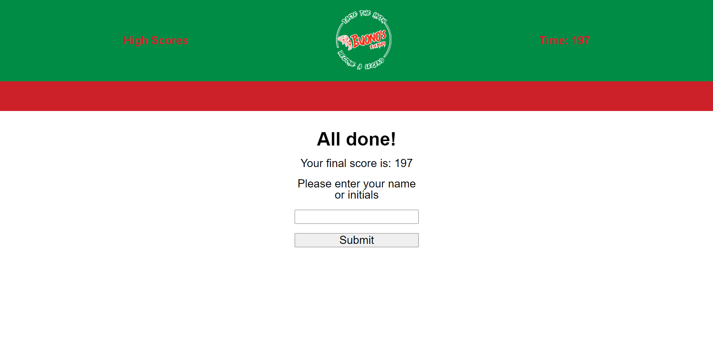

# Buonos Trivia

## Description
- The trivia game give the user 20 questions with multiple choice answers to select from and 200 seconds on a clock.
- Each question has 1 correct answer, if answered properly the next question is shown. If the worng answer is selected the answer is removed from the list and 5        seconds will be deducted from the clock.
- After the quiz is completed the score is tallied and the user can then enter thier name to see if they reached a high scpore.
- You can review the high score list at any point by selecting the highscore button.

## Simple Installation

Simpily follow this  link to view view the Password Generator appplication. https://jeremiahmiranda79.github.io/Buonos-Trivia/

## Usage

The landing page just gives a small introduction to the game.

The game consists of 20 questions with multiple choice answers and a clock that starts with 200 seconds. 

Once the game is completed the user will be prompted to submit a name.

A list is generated displaying all of the submitted scores.

## License

N/A

## Development

This project was created using Visual Code, HTML, CSS, GitHub, and JavaScript.

## How to Contribute

Currently this project is closed for contribution.

# Thank you
I appreciate your interest in my projects!